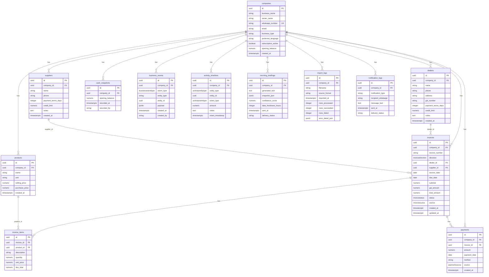

# Database Schema Document
**Phase 1 · Revision `ccba0c6` · Tag `phase-1`**

---

## ER Diagram



---

## Tables

### `companies`

| Column | Type | Constraint |
|--------|------|-----------|
| `id` | `uuid` | PK, default `uuid4` |
| `business_name` | `varchar` | NOT NULL |
| `owner_name` | `varchar` | NOT NULL |
| `whatsapp_number` | `varchar` | NOT NULL, UNIQUE |
| `email` | `varchar` | nullable |
| `business_type` | `varchar` | nullable |
| `preferred_language` | `varchar` | NOT NULL, default `en` |
| `subscription_active` | `boolean` | NOT NULL, default `true` |
| `opening_balance` | `numeric(14,2)` | NOT NULL, default `0` |
| `created_at` | `timestamptz` | NOT NULL, server_default `now()` |

Constraints: `uq_companies_whatsapp_number`

---

### `dealers`

| Column | Type | Constraint |
|--------|------|-----------|
| `id` | `uuid` | PK |
| `company_id` | `uuid` | FK → `companies.id` ON DELETE CASCADE |
| `name` | `varchar` | NOT NULL |
| `phone` | `varchar` | nullable |
| `address` | `varchar` | nullable |
| `gst_number` | `varchar` | nullable |
| `payment_terms_days` | `integer` | nullable |
| `credit_limit` | `numeric(14,2)` | nullable |
| `notes` | `text` | nullable |
| `created_at` | `timestamptz` | NOT NULL, server_default `now()` |

Indexes: `ix_dealers_company_id (company_id)`

---

### `suppliers`

| Column | Type | Constraint |
|--------|------|-----------|
| `id` | `uuid` | PK |
| `company_id` | `uuid` | FK → `companies.id` ON DELETE CASCADE |
| `name` | `varchar` | NOT NULL |
| `phone` | `varchar` | nullable |
| `payment_terms_days` | `integer` | nullable |
| `credit_limit` | `numeric(14,2)` | nullable |
| `notes` | `text` | nullable |
| `created_at` | `timestamptz` | NOT NULL, server_default `now()` |

Indexes: `ix_suppliers_company_id (company_id)`

---

### `products`

| Column | Type | Constraint |
|--------|------|-----------|
| `id` | `uuid` | PK |
| `company_id` | `uuid` | FK → `companies.id` ON DELETE CASCADE |
| `name` | `varchar` | NOT NULL |
| `unit` | `varchar` | nullable |
| `selling_price` | `numeric(14,2)` | nullable |
| `purchase_price` | `numeric(14,2)` | nullable |
| `created_at` | `timestamptz` | NOT NULL, server_default `now()` |

Indexes: `ix_products_company_id (company_id)`

---

### `invoices` ← central table

| Column | Type | Constraint |
|--------|------|-----------|
| `id` | `uuid` | PK |
| `company_id` | `uuid` | FK → `companies.id` ON DELETE CASCADE |
| `invoice_number` | `varchar` | NOT NULL |
| `direction` | `invoicedirection` | NOT NULL |
| `dealer_id` | `uuid` | FK → `dealers.id` ON DELETE SET NULL, nullable |
| `supplier_id` | `uuid` | FK → `suppliers.id` ON DELETE SET NULL, nullable |
| `invoice_date` | `date` | NOT NULL |
| `due_date` | `date` | NOT NULL |
| `subtotal` | `numeric(14,2)` | NOT NULL |
| `gst_amount` | `numeric(14,2)` | NOT NULL, default `0` |
| `total_amount` | `numeric(14,2)` | NOT NULL |
| `status` | `invoicestatus` | NOT NULL, default `Pending` |
| `source` | `invoicesource` | NOT NULL, default `csv_import` |
| `created_at` | `timestamptz` | NOT NULL, server_default `now()` |
| `updated_at` | `timestamptz` | NOT NULL, server_default `now()`, onupdate `now()` |

Constraints:
- `ck_invoices_dealer_or_supplier`: `dealer_id IS NOT NULL OR supplier_id IS NOT NULL`

Indexes:
- `ix_invoices_company_id (company_id)`
- `ix_invoices_company_status (company_id, status)`
- `ix_invoices_company_due_date (company_id, due_date)`

---

### `invoice_items`

| Column | Type | Constraint |
|--------|------|-----------|
| `id` | `uuid` | PK |
| `invoice_id` | `uuid` | FK → `invoices.id` ON DELETE CASCADE |
| `product_id` | `uuid` | FK → `products.id` ON DELETE SET NULL, nullable |
| `description` | `varchar` | NOT NULL |
| `quantity` | `numeric(14,4)` | NOT NULL |
| `unit_price` | `numeric(14,2)` | NOT NULL |
| `line_total` | `numeric(14,2)` | NOT NULL |

---

### `payments`

| Column | Type | Constraint |
|--------|------|-----------|
| `id` | `uuid` | PK |
| `company_id` | `uuid` | FK → `companies.id` ON DELETE CASCADE |
| `invoice_id` | `uuid` | FK → `invoices.id` ON DELETE CASCADE |
| `amount` | `numeric(14,2)` | NOT NULL |
| `payment_date` | `date` | NOT NULL |
| `method` | `varchar` | nullable |
| `source` | `paymentsource` | NOT NULL, default `csv_import` |
| `created_at` | `timestamptz` | NOT NULL, server_default `now()` |

Indexes:
- `ix_payments_company_id (company_id)`
- `ix_payments_invoice_id (invoice_id)`

---

### `cash_snapshots`

| Column | Type | Constraint |
|--------|------|-----------|
| `id` | `uuid` | PK |
| `company_id` | `uuid` | FK → `companies.id` ON DELETE CASCADE |
| `opening_balance` | `numeric(14,2)` | NOT NULL |
| `recorded_at` | `timestamptz` | NOT NULL, server_default `now()` |
| `recorded_by` | `varchar` | nullable |

---

### `business_events` ← append-only

| Column | Type | Constraint |
|--------|------|-----------|
| `id` | `uuid` | PK |
| `company_id` | `uuid` | FK → `companies.id` ON DELETE CASCADE |
| `event_type` | `businesseventtype` | NOT NULL |
| `entity_type` | `varchar` | NOT NULL (polymorphic, no FK) |
| `entity_id` | `uuid` | NOT NULL (polymorphic, no FK) |
| `payload` | `jsonb` | nullable |
| `created_at` | `timestamptz` | NOT NULL, server_default `now()` |
| `created_by` | `varchar` | nullable |

> **Append-only** — no `updated_at` by design. Never UPDATE after INSERT.

Indexes:
- `ix_business_events_company_created (company_id, created_at)`
- `ix_business_events_company_type (company_id, event_type)`

---

### `activity_timelines` ← append-only

| Column | Type | Constraint |
|--------|------|-----------|
| `id` | `uuid` | PK |
| `company_id` | `uuid` | FK → `companies.id` ON DELETE CASCADE |
| `entity_type` | `activityentitytype` | NOT NULL |
| `entity_id` | `uuid` | NOT NULL (polymorphic, no FK) |
| `event_type` | `activityeventtype` | NOT NULL |
| `amount` | `numeric(14,2)` | nullable |
| `notes` | `text` | nullable |
| `event_timestamp` | `timestamptz` | NOT NULL, server_default `now()` |

> **Append-only** — no `updated_at` by design. Never UPDATE after INSERT.

Indexes:
- `ix_activity_timelines_company_entity (company_id, entity_type, entity_id)`
- `ix_activity_timelines_company_timestamp (company_id, event_timestamp)`

---

### `morning_briefings`

| Column | Type | Constraint |
|--------|------|-----------|
| `id` | `uuid` | PK |
| `company_id` | `uuid` | FK → `companies.id` ON DELETE CASCADE |
| `generated_text` | `text` | NOT NULL |
| `snapshot_json` | `jsonb` | NOT NULL |
| `confidence_score` | `numeric(5,2)` | nullable |
| `data_freshness_hours` | `integer` | nullable |
| `sent_at` | `timestamptz` | nullable |
| `delivery_status` | `varchar` | nullable |

Indexes: `ix_morning_briefings_company_sent (company_id, sent_at)`

---

### `import_logs`

| Column | Type | Constraint |
|--------|------|-----------|
| `id` | `uuid` | PK |
| `company_id` | `uuid` | FK → `companies.id` ON DELETE CASCADE |
| `filename` | `varchar` | NOT NULL |
| `source_format` | `varchar` | NOT NULL |
| `imported_at` | `timestamptz` | NOT NULL, server_default `now()` |
| `rows_processed` | `integer` | NOT NULL, default `0` |
| `rows_succeeded` | `integer` | NOT NULL, default `0` |
| `rows_failed` | `integer` | NOT NULL, default `0` |
| `error_detail_json` | `jsonb` | nullable |

---

### `notification_logs`

| Column | Type | Constraint |
|--------|------|-----------|
| `id` | `uuid` | PK |
| `company_id` | `uuid` | FK → `companies.id` ON DELETE CASCADE |
| `notification_type` | `varchar` | NOT NULL |
| `recipient_whatsapp` | `varchar` | NOT NULL |
| `message_text` | `text` | NOT NULL |
| `sent_at` | `timestamptz` | NOT NULL, server_default `now()` |
| `delivery_status` | `varchar` | nullable |

---

## PostgreSQL Enum Types

| Type name | Values |
|-----------|--------|
| `invoicedirection` | `receivable`, `payable` |
| `invoicestatus` | `Draft`, `Sent`, `Pending`, `Partially_Paid`, `Paid`, `Overdue`, `Cancelled` |
| `invoicesource` | `csv_import`, `whatsapp` |
| `paymentsource` | `csv_import`, `whatsapp` |
| `businesseventtype` | `invoice_created`, `invoice_status_updated`, `payment_received`, `supplier_paid`, `reminder_sent`, `dealer_called`, `briefing_sent`, `data_imported`, `follow_up_sent`, `follow_up_responded` |
| `activityentitytype` | `dealer`, `supplier` |
| `activityeventtype` | `invoice_created`, `payment_received`, `reminder_sent`, `dealer_called`, `briefing_mentioned`, `overdue_flagged`, `follow_up_sent`, `follow_up_responded` |

---

## Migration

| Item | Value |
|------|-------|
| File | `alembic/versions/a09d0163b1e8_initial_schema.py` |
| Revision | `a09d0163b1e8` |
| `upgrade head` | ✅ passes |
| `downgrade base` | ✅ passes (tables + all 7 enums dropped) |
| `upgrade head` again | ✅ passes |

---

## Phase 1 Audit — TDD vs Implementation

### Audit method
Every column in every TDD table definition was compared line-by-line against the ORM model and the generated migration.

### Result: **No blocking deviations found**

| Table | TDD spec | Implementation | Status |
|-------|----------|----------------|--------|
| `companies` | 9 columns + created_at | 10 columns ✅ | ✅ Match |
| `dealers` | 8 columns + created_at | 10 columns ✅ | ✅ Match |
| `suppliers` | 7 columns + created_at | 9 columns ✅ | ✅ Match |
| `products` | 5 columns + created_at | 7 columns ✅ | ✅ Match |
| `invoices` | 13 columns + timestamps | 15 columns ✅ | ✅ Match |
| `invoice_items` | 7 columns | 7 columns ✅ | ✅ Match |
| `payments` | 7 columns + created_at | 8 columns ✅ | ✅ Match |
| `cash_snapshots` | 4 columns | 5 columns ✅ | ✅ Match |
| `business_events` | 8 columns | 8 columns ✅ | ✅ Match |
| `activity_timelines` | 8 columns | 8 columns ✅ | ✅ Match |
| `morning_briefings` | 7 columns | 8 columns ✅ | ✅ Match |
| `import_logs` | 8 columns | 9 columns ✅ | ✅ Match |
| `notification_logs` | 6 columns | 7 columns ✅ | ✅ Match |

### Observations (non-blocking)

> [!NOTE]
> **`invoice_number` has no UNIQUE constraint.** The TDD doesn't specify one, so none was added. However, in practice, `(company_id, invoice_number)` should be unique — two invoices from the same company cannot have the same number. This is a good constraint to add before importing real Tally data in Phase 2/Step 4. It does not block Phase 2 admin endpoints.

> [!NOTE]
> **`invoice_items` has no `company_id`.** Access to invoice items is always scoped through the invoice, which has a `company_id`. This is correct — adding a redundant FK to invoice_items was explicitly avoided since the TDD doesn't include one. The existing approach (join through invoices) matches the TDD.

> [!NOTE]
> **`MorningBriefing` has no `created_at`.** The TDD spec doesn't mention one. `sent_at` serves as the primary timestamp. This matches the spec exactly. If querying by creation time becomes necessary, it can be added in a future migration without consequence.

> [!TIP]
> **Add `UniqueConstraint("company_id", "invoice_number")` to `invoices` before Phase 2 Step 4** (invoice import). This prevents duplicate invoice numbers per company when processing Tally CSVs. A migration can be generated with one line.

### Enums audit

| Enum | TDD values | Implementation | Status |
|------|-----------|----------------|--------|
| `InvoiceDirection` | receivable, payable | ✅ exact | ✅ |
| `InvoiceStatus` | Draft, Sent, Pending, Partially_Paid, Paid, Overdue, Cancelled | ✅ exact (verified by test) | ✅ |
| `InvoiceSource` | csv_import, whatsapp | ✅ exact | ✅ |
| `PaymentSource` | csv_import, whatsapp | ✅ exact | ✅ |
| `BusinessEventType` | 10 values | ✅ exact | ✅ |
| `ActivityEntityType` | dealer, supplier | ✅ exact | ✅ |
| `ActivityEventType` | 8 values | ✅ exact | ✅ |

### Constraint audit

| Constraint | Specified in TDD | Implemented | Status |
|-----------|-----------------|-------------|--------|
| `dealer_id OR supplier_id NOT NULL` | Implied by design | ✅ `ck_invoices_dealer_or_supplier` | ✅ |
| `whatsapp_number` unique | Yes ("unique") | ✅ `uq_companies_whatsapp_number` | ✅ |
| Cascade deletes from companies | Yes (all child tables) | ✅ ON DELETE CASCADE everywhere | ✅ |
| invoice → dealer/supplier SET NULL | Yes (nullable FK) | ✅ ON DELETE SET NULL | ✅ |

### Append-only tables audit

| Table | `updated_at` present? | Status |
|-------|-----------------------|--------|
| `business_events` | ❌ (correct) | ✅ |
| `activity_timelines` | ❌ (correct) | ✅ |
| All others | Only `invoices` has it | ✅ |

---

## Recommended action before Phase 2

Add the `(company_id, invoice_number)` unique constraint to prevent duplicate invoice numbers per company. This is a one-line model change + one migration:

```python
# In app/models/invoice.py __table_args__, add:
UniqueConstraint("company_id", "invoice_number", name="uq_invoices_company_invoice_number"),
```

Then:
```powershell
uv run alembic revision --autogenerate -m "add_invoice_number_unique"
uv run alembic upgrade head
```

This is a **pre-Phase 2 patch**, not a Phase 2 item. It protects data integrity before any import or API is built.
